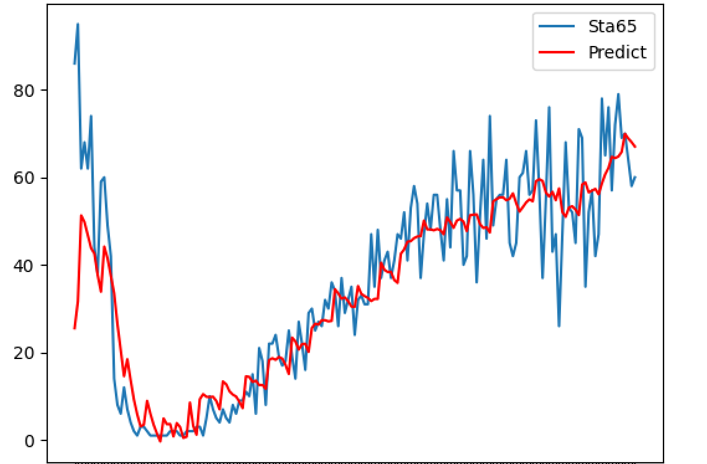

# 预测模型**可行性**分析

需要解决的问题

1. 客流检测能力不足
2. 缺乏客流精准管控方法
3. 缺乏对突发客流的提前评估和预测

## 影响因素

### 必须影响因素

1. o 几月
2. o 星期几(0, 1, 2, 3, 4, 5, 6)
3. o 是否为节假日(1, 2, 3)
4. ? 时间小时(0, 1, 2,--, 11, 12,13, ---,16, 17, 18,---, 23, 24)
5. x 地铁几号线 ( 1, 2, 3, 4, 5, 10, 11, 12)  ( 废除)
6. ? 地铁站点等级 ( 待定 )
7. ? 票价
8. ? 温度(可选)
9. ? 天气(可选)

### 可变影响因素 ( 暂定 )

1. 是否存在集体活动等突发可变因素( 应对突发客流的检测 )
2. 是否居于学校, 公园, 等场所附近(可能会影响站点等级划分)
3. 是否与前几天有关联
4. 是否有较大波动 ()
5. 与实际情况有较大误差的应对情况

### 输出值

一个数字 => 预测流量

## 模型选择

* 参数动态可调节(时间, 站点, 路线)
* 具备实时计算能力

已废除

初步选择普通神经网络做实验 ( 太脑残的想法 )

卷积神经网络 ( 根本不是一回事 )

PS: 人家的16层VGG是现成的东西, 能直接复制粘贴的那种

### 2. 循环神经网络 ( 只能用这个 )

1. SimpleRNN
2. LSTM
3. GRU

## 结论日志

#### 1月27日

```python
# 1. 记录
1. 星期几: 周六日相对流量有小幅度提升 
2. 某月对流量有很大影响
3. 某日对流量几乎无影响
4. 地铁几号线, 地铁站点不适合作为输入特征
5. 票价暂时不知道怎么输入
6. 因为输入特征只有 (flow. month. 是否放假. 星期几), 计算强度很低, 将对所有站点单独计算相应模型
# 2. 模型 / 参数
# 经过n多次实验, 这玩意一层网络就够了
model = tf.keras.Sequential([
        GRU(100),  # x_train = np.reshape(x_train, (x_train.shape[0], 14, len(x_arr)))
        Dropout(0.5),
        Dense(1),
    ])
optimizer = tf.keras.optimizers.Adam(0.0001),
batch_size=1, epochs=50,
x_arr =  [ flow[0], ] + list(dayprop) + [month, int(anyday)]
```



# 统计任务

## 1. 单月整体客流波动的分析

#### API


| 计算范围 | 数据格式 |
| - | - |
| 单月整体 | 列表 |
| 单月各条线路 | 字典 |
| 单月各个站点(按线路划分) | 嵌套字典 |

```json
{
    ret:0
    data:{
    	all_flow:[12,34,432,54,7,86,454,432,767],  
        route_flow:{
            1号线:[1,2,45],
            2号线:[44,786]
            },
        sta_flow:{
            1号线:{
            sta1:{1:34,2:43},
            sta2:{6:43,8:234}
            },
            2号线:{
                sta4:{},
                sta5:{}
                },
            }
        },

}
```

#### 详细过程

```python
# 1. 单月整体
pandas直接根据月筛选统计数据
# 3. sta
先统计全部sta的每个月得到:
{
    sta63: {1:12, 2:34},
    sta45: {1:11, 2:53},
    sta127: {1:11, 2:53},
}
# 2. route
直接加和
```

## 2. 工作日和周末的客流分析


| 统计对象 | 统计范围 | 数据结构 |
| - | - | - |
|   |   |   |
|   |   |   |
|   |   |   |

## 3. 但站点客流出/入站分析

## 4. 用户年龄结构分析

## 5. 早晚高峰客流站点分布分析

## 6. 站点OD客流量分析

## 7. 线路断面(按站点)流量分析

## 8. 自愿拓展分析
